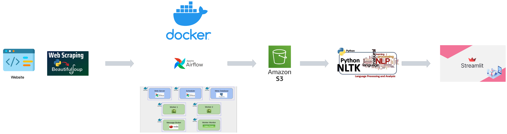

# End to End Sentiment Analysis Project

# Introduction

This project encompasses the extraction of review data from a website through scraping techniques. Utilizing Airflow, we'll orchestrate a data pipeline responsible for the extraction and subsequent storage of these reviews into an S3 bucket.

Following this, we'll execute sentiment analysis on the gathered data. Finally, we leverage Streamlit to deploy an interactive dashboard, facilitating a comprehensive view of the sentiment analysis results, ensuring a user-friendly exploration of the insights derived from the analysis

# Architecture


Components:

- **Beautifoul Soup**: We'll utilise this library to scrape data from an airline reviews website.
- **Docker**: Facilitates the execution of airflow in a containerized environment.
- **Apache Airflow**: Responsible for orchestrating the pipeline, carrying out scheduled scraping and uploading the raw data into a s3 bucket.
- **S3 Bucket**: Allows for storage of the raw data.
- **NLTK Library**: Facilitates text processing for sentiment analysis.
- **Streamlit**: Allows the deployment of an interactive dashboard relaying the analysis findings.

# Getting Started
## Docker Airflow Setup
1. Download [Docker Desktop](https://www.docker.com/products/docker-desktop/)
2. Clone the repository.
   ```bash
    git clone [https://github.com/airscholar/RedditDataEngineering.git](https://github.com/Ds2023/ML-Airflow-Sentiment-Streamlit)
   ```
3. cd into the repository
4. Navigate to the docker-compose.yaml file and adjuct environment variables as desired.
5. Initialize airflow in the docker container.
   ```bash
    docker compose airflow-init
   ```
6. Starting the containers
   ```bash
    docker-compose up 
   ```
7. Confirm all containers are running.
   ```bash
    docker ps
   ```
  
8. Launch the Airflow web UI.
   ```bash
    open http://localhost:8080
   ```
## AWS S3 Bucket Setup
1. Download [AWS CLI](https://aws.amazon.com/cli/)
2. Authenticate the AWS CLI
   ```bash
    aws configure
   ```
3. Create a s3 bucket
   ```bash
    aws s3api create-bucket --bucket <bucket-name> --region <region> --create-bucket-configuration LocationConstraint=<region>
   ```
4. Verify bucket creation
   ```bash
    aws s3 ls
   ```
## Streamlit Setup
### Prerequisites
- Ensure python is installed.
- Create a virtual environment
1. Install streamlit.
   ```bash
    pip install streamlit 
   ```
2. Naivgate to the directory where the script is located.
3. Run the streamlit app.
   ```bash
    streamlit run app.py
   ```
